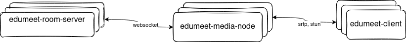

# Edumeet media node

This is the media node service for the Edumeet project. 



It has a default port range of 250 ports, but can be configured to use more or less by passing arguments when building the container.

To calculate the needed number of ports, the following is used:
- N ports where N is the number of cores on the server for all the user transports
- 1 port pr pipe between any two routers. For an internal pipe that means 2 ports are used, for and external pipe that means 1 port is used.

Add up the number of cores, and the number of pipes between routers and you have the number of ports needed. This will naturally limit itself because the amount of piping between routers is naturally limited because of overall server load.

## Usage

### Running the service manually

```bash
$ yarn install
$ yarn start --ip <public-ip-of-host> --secret <secret-shared-with-room-server>
```

To run the service you need to have Node.js version 18 or higher installed. Alternatively you can get some debug output by running it like this:

```bash
$ DEBUG=edumeet:* yarn start --ip <public-ip-of-host> --secret <secret-shared-with-room-server>
```
### Docker
https://github.com/edumeet/edumeet-docker/tree/4.x has guidelines for running the next generation Edumeet as docker containers.
