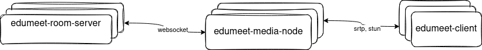

# Edumeet media node

This is the media node service for the Edumeet project.



It has a default port range of 250 ports, but can be configured to use more or less by passing arguments when building the container.

To calculate the needed number of ports, the following is used:
- N ports where N is the number of cores on the server for all the user transports
- 1 port pr pipe between any two routers. For an internal pipe that means 2 ports are used, for and external pipe that means 1 port is used.

Add up the number of cores, and the number of pipes between routers and you have the number of ports needed. This will naturally limit itself because the amount of piping between routers is naturally limited because of overall server load.

## Usage

### Running the service manually

```bash
$ yarn install
$ yarn start --ip <public-ip-of-host> --secret <secret-shared-with-room-server>
```

To run the service you need to have Node.js version 22 or higher installed. Alternatively you can get some debug output by running it like this:

```bash
$ DEBUG=edumeet:* yarn start --ip <public-ip-of-host> --secret <secret-shared-with-room-server>
```
### Docker
https://github.com/edumeet/edumeet-docker/tree/4.x has guidelines for running the next generation Edumeet as docker containers.

## Configuration

All configuration is passed as command line arguments. Run the service with `--help`
to print the same list at runtime.

### General options

| Option | Default | Description |
| --- | --- | --- |
| `--ip <ip>` | — | **Required.** IPv4 address used to create mediasoup transports. |
| `--ip6 <ip>` | none | IPv6 address used to create mediasoup transports. |
| `--announcedIp <ip>` | none | IPv4 address announced to clients, when it differs from `--ip` (NAT). |
| `--announcedIp6 <ip>` | none | IPv6 address announced to clients. |
| `--listenPort <port>` | `3000` | Port to listen on for incoming socket connections. |
| `--listenHost <host>` | `0.0.0.0` | Host to listen on for incoming socket connections. |
| `--secret <string>` | none | Shared secret used to authenticate with the room server. |
| `--cert <path>` | `./certs/edumeet-demo-cert.pem` | Certificate file used for the socket. |
| `--key <path>` | `./certs/edumeet-demo-key.pem` | Key file used for the socket. |
| `--availableUpload <mbps>` | `1000` | Available upload bandwidth, in Mbps. |
| `--availableDownload <mbps>` | `1000` | Available download bandwidth, in Mbps. |
| `--initialAvailableOutgoingBitrate <bps>` | `600000` | Initial available outgoing bitrate for transports. |
| `--maxIncomingBitrate <bps>` | `10000000` | Maximum incoming bitrate for transports. |
| `--maxOutgoingBitrate <bps>` | `10000000` | Maximum outgoing bitrate for transports. |
| `--rtcMinPort <port>` | `40000` | Lower bound of the mediasoup transport port range. |
| `--rtcMaxPort <port>` | `40249` | Upper bound of the mediasoup transport port range. |
| `--numberOfWorkers <num>` | number of host cores | Number of mediasoup workers to create. |
| `--loadPollingInterval <ms>` | `10000` | Interval at which load usage is polled. |
| `--cpuPercentCascadingLimit <percent>` | `66` | CPU usage percentage at which cascading starts. |
| `--samplesStorePath <path>` | none | Local directory for observertc JSONL sample files. See below. |
| `--samplesUploadUri <uri>` | none | Upload destination for observertc samples. See below. |

### observertc sample storage

Clients send [observertc](https://github.com/ObserveRTC) ClientSample payloads over the
observertc-samples data channel. The media node turns them into:

| Artifact | When it is produced | Content type |
| --- | --- | --- |
| <clientId>.jsonl | client leaves and its sink closes | application/x-ndjson |
| call-summary.json | call closes | application/json |
| mediasoup-router-<routerId>.json | router is removed | application/json |

#### Required options

| Option | Purpose |
| --- | --- |
| --samplesStorePath <path> | Local directory for per-client JSONL files. |
| --samplesUploadUri <uri> | Upload destination for all artifacts. |

| samplesStorePath | samplesUploadUri | Behavior |
| --- | --- | --- |
| unset | unset | Samples are processed then dropped. |
| set | unset | JSONL files are stored locally only. |
| unset | set | Upload target is ignored, with a warning. |
| set | set | JSONL files are staged locally and uploaded; call summaries and router samples are uploaded too. |

samplesStorePath is mandatory for uploads. If samplesUploadUri is set without samplesStorePath,
uploads are disabled with a warning.

#### Upload behavior

- Upload failures are logged and do not stop calls.
- Invalid samplesUploadUri values are logged and uploads stay disabled.
- Uploads are per artifact (no queue, no replay after restart).
- Logical object keys are identical across S3 and HTTP targets.

#### deleteAfterUpload

Set deleteAfterUpload=true in samplesUploadUri to delete local staged files after a
successful upload.

- Deletion applies to file-based uploads (artifacts uploaded from local disk).
- In current flow, this is the per-client JSONL sink files.
- Files are deleted only after upload succeeds.
- Deletion errors are logged as warnings and do not interrupt the node.
- If omitted (default), staged files remain on disk.

Examples:

- s3://edumeet-samples/prod?region=eu-north-1&deleteAfterUpload=true
- https://collector.example.com/observertc?credentialsEnv=COLLECTOR&deleteAfterUpload=true

#### samplesUploadUri formats

| Scheme | Target |
| --- | --- |
| s3:// or bare bucket name | S3 or S3-compatible storage (MinIO, Ceph, ...). |
| http:// or https:// | HTTP collector, one POST per object. |

S3 format:

s3://<bucket>[/<keyPrefix>][?<param>=<value>&...]

| Parameter | Default | Notes |
| --- | --- | --- |
| endpoint | AWS endpoint | Custom S3-compatible endpoint URL. |
| region | AWS_REGION / AWS_DEFAULT_REGION / us-east-1 when endpoint is set | Region used by SDK. |
| pathStyle | true when endpoint is set, else false | Path-style or virtual-host-style addressing. |
| credentialsEnv | none | Reads <PREFIX>_ACCESS_KEY_ID and <PREFIX>_SECRET_ACCESS_KEY (optional <PREFIX>_SESSION_TOKEN). |
| maxAttempts | SDK default | Retry attempts, integer >= 1. |
| deleteAfterUpload | false | Delete staged JSONL file after successful upload. |

HTTP format:

http[s]://<host>[:<port>][/<basePath>][?<param>=<value>&...]

| Parameter | Default | Notes |
| --- | --- | --- |
| credentialsEnv | none | Reads bearer token from <PREFIX>_TOKEN. |
| maxAttempts | 3 | Retry attempts, integer >= 1. |
| deleteAfterUpload | false | Delete staged JSONL file after successful upload. |

Credentials are never read from the URI itself. Use credentialsEnv and environment variables.

#### Object keys

- <roomId>/<callId>/<clientId>.jsonl
- <roomId>/<callId>/call-summary.json
- <roomId>/<callId>/mediasoup-router-<routerId>.json

roomId falls back to unknown-room if it was never reported.

#### Quick examples

AWS S3:

```bash
yarn start --ip <public-ip> \
  --samplesStorePath /var/lib/edumeet/samples \
  --samplesUploadUri "s3://edumeet-samples/prod?region=eu-north-1&deleteAfterUpload=true"
```

MinIO:

```bash
export MINIO_ACCESS_KEY_ID=...
export MINIO_SECRET_ACCESS_KEY=...
yarn start --ip <public-ip> \
  --samplesStorePath /var/lib/edumeet/samples \
  --samplesUploadUri "s3://samples/dev?endpoint=http://minio.minio-ns.svc.cluster.local:9000&credentialsEnv=MINIO&deleteAfterUpload=true"
```

HTTP collector:

```bash
export COLLECTOR_TOKEN=...
yarn start --ip <public-ip> \
  --samplesStorePath /var/lib/edumeet/samples \
  --samplesUploadUri "https://collector.example.com/observertc?credentialsEnv=COLLECTOR&deleteAfterUpload=true"
```
